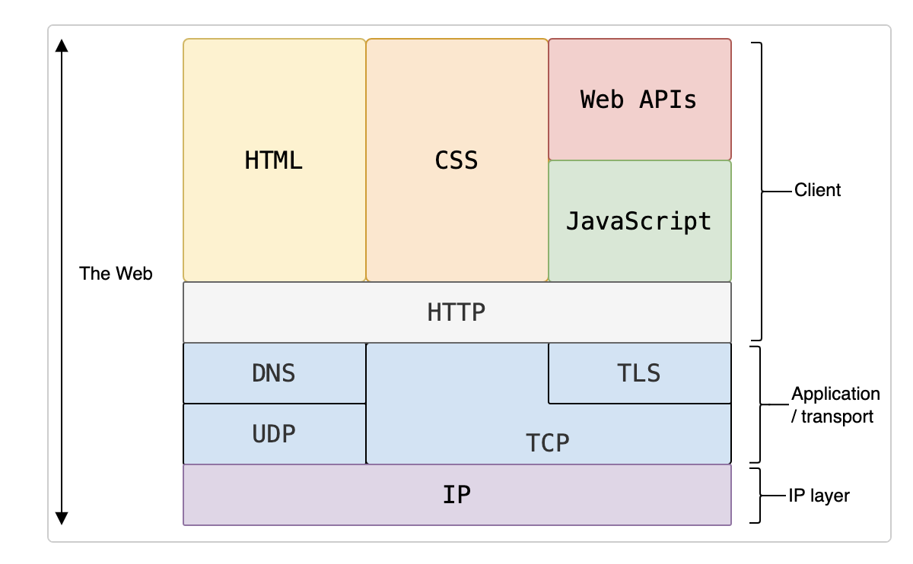

# HTTP

HTTP는 HTML 문서와 같은 리소스를 가져오기 위한 프로토콜입니다. 이는 웹에서의 **데이터 교환의 기초**이며, 클라이언트-서버 프로토콜로서 요청은 주로 웹 브라우저인 수신자에 의해 시작됩니다. 완전한 문서는 일반적으로 텍스트 콘텐츠, layout instructions, 이미지, 비디오, 스크립트 등과 같은 리소스로 구성됩니다.


Clients and servers communicate by exchanging individual messages(데이터 스트림이 아닌). 클라이언트가 보내는 메시지는 **request**이라고 하며, 서버가 응답으로 보내는 메시지는 **response**이라고 합니다.



Designed in the early 1990s, HTTP는 시간이 지남에 따라 발전해온 확장 가능한 프로토콜입니다. 이는 TCP 또는 TLS로 암호화된 TCP 연결을 통해 전송되는 애플리케이션 계층 프로토콜이지만, 이론적으로는 어떤 신뢰할 수 있는 전송 프로토콜도 사용할 수 있습니다. 확장성 덕분에 HTTP는 하이퍼텍스트 문서뿐만 아니라 이미지와 비디오를 가져오는 데 사용되며, HTML 폼 결과와 같은 콘텐츠를 서버에 게시하는 데도 사용됩니다. 또한 HTTP는 웹 페이지를 필요에 따라 업데이트하기 위해 문서의 일부를 가져오는 데에도 사용될 수 있습니다.

<br/>
<br/>
<br/>
<br/>

## Components of HTTP-based systems

HTTP는 클라이언트-서버 프로토콜입니다: 요청은 사용자 에이전트(user-agent) 또는 그 대신에 프록시가 보내는 하나의 엔티티에 의해 전송됩니다. 대부분의 경우 사용자 에이전트는 웹 브라우저이지만, 검색 엔진 인덱스를 채우고 유지하기 위해 웹을 크롤링하는 로봇과 같은 다른 것일 수도 있습니다.

<br/>

---

#### Entities

데이터가 오가는 과정에서 각각의 역할을 하는 요소들을 의미합니다.

-   사용자 에이전트: 주로 웹 브라우저로, 웹 페이지를 요청하는 역할을 합니다.
-   서버: 요청을 받아서 응답을 보내는 역할을 합니다.
-   프록시: 클라이언트와 서버 사이에서 중개 역할을 하며, 요청을 전달하거나 응답을 캐시하는 역할을 합니다.

---

<br/>

각 개별 요청은 서버에 전송되며, 서버는 이를 처리하고 response이라고 불리는 답변을 제공합니다. 클라이언트와 서버 사이에는 다양한 엔티티가 있으며, 이들은 총칭하여 프록시(proxy)라고 불리며, 서로 다른 작업을 수행하고 게이트웨이 또는 캐시 역할을 합니다.


실제로 웹 브라우저와 요청을 처리하는 서버 사이에는 더 많은 컴퓨터가 있습니다: 라우터, 모뎀 등이 그 예입니다. 웹의 계층적 설계 덕분에 이러한 요소들은 네트워크 계층과 전송 계층에 숨겨져 있습니다. HTTP는 가장 위에 위치한 애플리케이션 계층에 있습니다. 네트워크 문제를 진단하는 데는 중요하지만, 기본적인 계층들은 HTTP 설명에는 대부분 관련이 없습니다.

<br/>
<br/>

### Client: the user-agent

user-agent는 사용자를 대신해 작동하는 도구를 의미합니다. 이 역할은 주로 웹 브라우저가 수행하지만, 엔지니어와 웹 개발자가 애플리케이션을 디버그할 때 사용하는 프로그램도 이 역할을 할 수 있습니다.

브라우저는 항상 **request를 시작하는 주체**입니다. 서버가 요청을 시작하는 경우는 없습니다(다만, 몇 가지 메커니즘이 추가되어 서버가 시작한 메시지를 시뮬레이션하는 경우도 있습니다).

웹 페이지를 표시하기 위해 브라우저는 해당 페이지를 나타내는 HTML 문서를 가져오기 위한 원본 요청을 보냅니다. 그런 다음 이 파일을 분석하고, 실행 스크립트, 표시할 레이아웃 정보(CSS), 페이지에 포함된 하위 리소스(보통 이미지와 비디오)에 대한 추가 요청을 보냅니다. 브라우저는 이러한 리소스를 결합하여 완전한 문서인 웹 페이지를 표시합니다. 브라우저에서 실행된 스크립트는 이후 단계에서 더 많은 리소스를 가져올 수 있으며, 브라우저는 그에 따라 웹 페이지를 업데이트합니다.

웹 페이지는 하이퍼텍스트 문서입니다. 이는 표시된 콘텐츠의 일부가 링크로 되어 있어, 사용자가 이를 활성화(주로 마우스를 클릭하여)하면 **새로운 웹 페이지를 가져올 수 있다는 의미**입니다. 이를 통해 사용자는 the user-agent를 통해 웹을 탐색할 수 있습니다. 브라우저는 이러한 지시를 HTTP 요청으로 변환하고, HTTP 응답을 해석하여 사용자에게 명확한 응답을 제공합니다.

<br/>
<br/>

### The Web server

On the opposite side of the communication channel is the server, which serves the document as requested by the client. 서버는 가상적으로 하나의 기계로만 나타나지만, 실제로는 부하를 분산하는 여러 대의 서버(로드 밸런싱)나 캐시, 데이터베이스 서버, 전자상거래 서버와 같은 다른 소프트웨어가 결합되어 문서를 필요에 따라 완전히 또는 부분적으로 생성할 수 있습니다.

서버는 반드시 하나의 기계일 필요는 없으며, 여러 서버 소프트웨어 인스턴스가 동일한 기계에서 호스팅될 수 있습니다. HTTP/1.1 및 Host 헤더를 사용하면 심지어 동일한 IP 주소를 공유할 수도 있습니다.

<br/>
<br/>

### Proxies

웹 브라우저와 서버 사이에는 HTTP 메시지를 중계하는 여러 대의 컴퓨터와 기계가 있습니다. 웹 스택의 계층적 구조 덕분에 대부분은 전송, 네트워크 또는 물리적 수준에서 작동하며, HTTP 계층에서는 투명하게 작동하여 성능에 상당한 영향을 미칠 수 있습니다. **애플리케이션 계층에서 작동하는 것들은 일반적으로 프록시**라고 불립니다. These can be transparent, 이 경우 수신한 요청을 어떠한 변경 없이 그대로 전달합니다. 반면 비투명한 프록시는 요청을 서버에 전달하기 전에 어떤 식으로든 요청을 변경합니다. 프록시는 여러 가지 기능을 수행할 수 있습니다:

-   caching (the cache can be public or private, like the browser cache)
-   filtering (like an antivirus scan or parental controls)
-   load balancing: 여러 서버가 서로 다른 요청을 처리할 수 있도록 허용합니다.
-   authentication: 다양한 리소스에 대한 접근을 제어합니다.
-   logging: allowing the storage of historical information

<br/>

---

#### Application Layer

Application Layer은 네트워크 통신 모델에서 가장 높은 계층으로, 사용자와 직접 상호작용하는 소프트웨어와 서비스가 위치하는 곳입니다. 이 계층은 데이터 전송을 위한 프로토콜을 정의하며, 웹 브라우저, 이메일 클라이언트, 파일 전송 프로그램 등과 같은 애플리케이션이 포함됩니다.

어플리케이션 계층은 사용자가 웹 페이지를 요청하거나 이메일을 보내는 등의 작업을 수행할 수 있도록 지원하며, 이러한 요청과 응답을 처리하는 다양한 프로토콜(예: HTTP, FTP, SMTP 등)을 사용합니다. 즉, 어플리케이션 계층은 사용자와 네트워크 간의 인터페이스 역할을 합니다.

---

<br/>
<br/>
<br/>
<br/>

## Basic aspects of HTTP

### HTTP is simple

HTTP는 일반적으로 간단하고 사람이 읽을 수 있도록 설계되었습니다. HTTP/2에서 메시지를 프레임으로 캡슐화하면서 추가된 복잡성에도 불구하고, HTTP 메시지는 인간이 읽고 이해할 수 있습니다. 이는 개발자에게 테스트를 더 쉽게 하고, 초보자에게는 복잡성을 줄여줍니다.

<br/>
<br/>

### HTTP is extensible

HTTP/1.0에서 도입된 HTTP 헤더 덕분에 이 프로토콜은 쉽게 확장하고 실험할 수 있습니다. 새로운 기능은 클라이언트와 서버 간의 새로운 헤더의 의미에 대한 간단한 합의만으로도 도입할 수 있습니다.

<br/>
<br/>

### HTTP is stateless, but not sessionless

HTTP is stateless: there is no link between two requests being successively carried out on the same connection. 이는 특정 페이지와 일관되게 상호작용하려는 사용자에게 문제가 될 수 있습니다. 예를 들어, 전자상거래 쇼핑 바구니를 사용할 때 그렇습니다. 하지만 HTTP의 핵심이 stateless 반면, HTTP 쿠키를 사용하면 상태 있는 세션을 사용할 수 있습니다. 헤더 확장성을 이용해 HTTP 쿠키가 워크플로에 추가되어, 각 HTTP 요청에서 동일한 컨텍스트나 상태를 공유하는 세션을 생성할 수 있습니다.

---

#### Session

사용자가 웹 애플리케이션과 상호작용하는 동안의 일련의 활동을 의미합니다. 세션은 사용자가 웹사이트를 방문하고 있는 동안 유지되는 상태 정보를 저장하여, 여러 요청 간에 사용자 정보를 기억할 수 있게 해줍니다.

예를 들어, 쇼핑몰에서 제품을 장바구니에 담거나 로그인한 상태를 유지하는 것이 세션의 예입니다. HTTP는 기본적으로 stateless, but 쿠키와 같은 기술을 사용하여 세션 정보를 저장하고 관리함으로써 사용자가 일관된 경험을 할 수 있도록 돕습니다. 세션이 활성화되면, 사용자는 이전의 상호작용을 기반으로 계속해서 웹사이트와 상호작용할 수 있습니다.

---

<br/>
<br/>

### HTTP and connections

A connection is controlled at the transport layer, HTTP의 기본 범위에서 벗어납니다. HTTP는 기본 전송 프로토콜이 연결 기반일 필요는 없지만, 신뢰성을 요구하며, 최소한 오류가 발생할 경우 메시지를 잃지 않아야 합니다. 인터넷에서 가장 일반적인 두 가지 전송 프로토콜 중 TCP는 신뢰성이 있으며, UDP는 그렇지 않습니다. 따라서 **HTTP는 TCP 표준에 의존**하며, which is connection-based.

클라이언트와 서버가 HTTP 요청/응답 쌍을 교환하기 전에 TCP 연결을 설정해야 하며, 이 과정은 여러 번의 왕복이 필요합니다. HTTP/1.0의 기본 동작은 각 HTTP 요청/응답 쌍마다 별도의 TCP 연결을 여는 것입니다. 이는 여러 요청을 가까운 시간 안에 보낼 때 단일 TCP 연결을 공유하는 것보다 비효율적입니다.

이러한 단점을 보완하기 위해 HTTP/1.1에서는 pipelining(구현이 어려운 것으로 판명됨)과 지속적 연결을 도입했습니다. 이로 인해 기본 TCP 연결을 Connection 헤더를 사용하여 부분적으로 제어할 수 있습니다. HTTP/2는 단일 연결을 통해 메시지를 다중화하여 연결을 더 효율적으로 유지하는 한 걸음 더 나아갔습니다.

<br/>
<br/>
<br/>
<br/>

## What can be controlled by HTTP

HTTP의 이러한 확장 가능한 특성 덕분에 시간이 지남에 따라 웹에 대한 더 많은 제어와 기능이 가능해졌습니다. 캐시와 인증 방법은 HTTP 역사 초기에 처리된 기능들입니다. 반면, 출처 제약(origin constraint)을 완화할 수 있는 기능은 2010년대에 추가되었습니다.

Here is a list of common features controllable with HTTP:

-   캐싱: 문서의 캐싱 방식은 HTTP로 제어할 수 있습니다. 서버는 프록시와 클라이언트에게 무엇을 캐시하고 얼마나 오랫동안 캐시할 것인지 지시할 수 있습니다. 클라이언트는 중간 캐시 프록시에게 저장된 문서를 무시하도록 요청할 수 있습니다.

-   Relaxing the origin constraint: 웹 브라우저는 snooping 및 기타 개인 정보 침해를 방지하기 위해 웹사이트 간의 엄격한 분리를 시행합니다. 동일한 출처에서 온 페이지만 웹 페이지의 모든 정보에 접근할 수 있습니다. 이러한 제약은 서버에 부담이 되지만, HTTP 헤더를 사용하여 서버 측에서 이 엄격한 분리를 완화할 수 있습니다. 이를 통해 문서는 서로 다른 도메인에서 가져온 정보의 패치워크가 될 수 있으며, 보안과 관련된 이유로 그렇게 할 수도 있습니다.

-   Authentication: 특정 사용자만 접근할 수 있도록 보호된 페이지가 있을 수 있습니다. HTTP는 WWW-Authenticate와 유사한 헤더를 사용하거나 HTTP 쿠키를 설정하여 기본 인증을 제공할 수 있습니다.

-   Proxy and tunneling: 서버나 클라이언트는 종종 인트라넷에 위치하여 다른 컴퓨터로부터 실제 IP 주소를 숨깁니다. 이 경우 HTTP 요청은 이 네트워크 장벽을 넘기 위해 프록시를 통과합니다. 모든 프록시가 HTTP 프록시는 아닙니다. 예를 들어, SOCKS 프로토콜은 더 낮은 수준에서 작동합니다. ftp와 같은 다른 프로토콜도 이러한 프록시에서 처리될 수 있습니다.

-   세션: HTTP 쿠키를 사용하면 요청과 서버의 상태를 연결할 수 있습니다. 이는 기본 HTTP가 무상태 프로토콜임에도 불구하고 세션을 생성합니다. 이는 전자상거래 쇼핑 바구니뿐만 아니라 사용자 출력 구성을 허용하는 모든 사이트에 유용합니다.

<br/>

---

#### Snooping

네트워크를 통해 전송되는 데이터를 몰래 엿보는 행위를 의미합니다. 이는 사용자의 개인 정보나 중요한 데이터를 무단으로 가로채거나 확인하는 것을 포함합니다. 웹 브라우저는 이러한 스누핑을 방지하기 위해 웹사이트 간의 엄격한 분리를 시행하여, 한 웹사이트에서 다른 웹사이트의 정보에 접근하지 못하도록 합니다.

#### Tunneling

네트워크 프로토콜을 사용하여 데이터를 안전하게 전송하기 위해 다른 프로토콜의 데이터를 캡슐화하는 방법입니다. 이를 통해 사용자는 보안이 취약한 네트워크를 통해 안전하게 데이터를 전송할 수 있습니다. 예를 들어, HTTP 요청이 프록시를 통해 전송될 때, 이 요청은 터널링을 통해 숨겨진 IP 주소를 유지하며 안전하게 전달될 수 있습니다. 터널링은 VPN(가상 사설망)와 같은 기술에서도 사용되어 데이터를 암호화하고 보호합니다.

---

<br/>
<br/>
<br/>
<br/>

## HTTP flow

클라이언트가 서버(최종 서버 또는 중간 프록시)와 통신하고자 할 때, 다음과 같은 단계를 수행합니다:

1. Open a TCP connection

    TCP 연결은 요청을 보내거나 여러 요청을 보내고 응답을 받는 데 사용됩니다. 클라이언트는 새로운 연결을 열거나 기존의 연결을 재사용하거나 여러 개의 TCP 연결을 서버에 열 수 있습니다.

2. Send an HTTP message

HTTP 메시지는 (HTTP/2 이전에는) 사람이 읽을 수 있는 형식입니다. HTTP/2에서는 이러한 간단한 메시지가 프레임으로 캡슐화되어 직접 읽을 수 없지만, 원리는 동일합니다. 예를 들어:

```
GET / HTTP/1.1
Host: developer.mozilla.org
Accept-Language: fr
```

3. Read the response sent by the server, such as:

```
HTTP/1.1 200 OK
Date: Sat, 09 Oct 2010 14:28:02 GMT
Server: Apache
Last-Modified: Tue, 01 Dec 2009 20:18:22 GMT
ETag: "51142bc1-7449-479b075b2891b"
Accept-Ranges: bytes
Content-Length: 29769
Content-Type: text/html

<!doctype html>… (here come the 29769 bytes of the requested web page)
```

4. Close or reuse the connection for further requests.

HTTP pipelining이 활성화되면, 첫 번째 응답이 완전히 수신되기를 기다리지 않고 여러 요청을 보낼 수 있습니다. 그러나 HTTP pipelining은 구형 소프트웨어와 최신 버전이 공존하는 기존 네트워크에서 구현하기 어려운 것으로 판명되었습니다. 따라서 HTTP/2에서는 프레임 내에서 더 강력한 다중화 요청으로 HTTP pipelining이 대체되었습니다.

<br/>
<br/>
<br/>
<br/>

## HTTP Messages

HTTP 메시지는 HTTP/1.1 및 이전 버전에서 사람이 읽을 수 있는 형식으로 정의되었습니다. 그러나 HTTP/2에서는 이러한 메시지가 a binary structure 프레임에 포함되어, 헤더 압축 및 다중화와 같은 최적화를 가능하게 합니다. 이 버전의 HTTP에서는 원래 HTTP 메시지의 일부만 전송되더라도 각 메시지의 의미는 변경되지 않으며, 클라이언트는 원본 HTTP/1.1 요청을 (가상적으로) 재구성합니다. 따라서 HTTP/2 메시지를 HTTP/1.1 형식으로 이해하는 것이 유용합니다.

HTTP 메시지에는 요청과 응답의 두 가지 유형이 있으며, 각 유형은 고유한 형식을 가지고 있습니다.

### Requests

An example HTTP request:


1. HTTP method: 일반적으로 GET, POST와 같은 동사나 OPTIONS, HEAD와 같은 명사로 정의되어, **클라이언트가 수행하려는 작업**을 나타냅니다. 일반적으로 클라이언트는 리소스를 가져오기 위해 GET을 사용하거나 HTML 폼의 값을 전송하기 위해 POST를 사용하지만, 다른 경우에는 더 많은 작업이 필요할 수 있습니다.

2. The path of the resource to fetch: 가져올 리소스의 URL에서 맥락상 명백한 요소를 제외한 부분입니다. 예를 들어, 프로토콜(http://), 도메인(developer.mozilla.org), TCP 포트(여기서는 80)를 제외한 리소스의 경로입니다.

3. The version of the HTTP protocol.

4. Optional headers that convey additional information for the servers.: 서버에 추가 정보를 전달하는 헤더입니다.

5. A body: POST와 같은 일부 메서드에서 사용되며, 응답의 본문과 유사하게 전송되는 리소스를 포함합니다.

<br/>
<br/>

### Responses

An example response:


Responses consist of the following elements:

-   The version of the HTTP protocol they follow.
-   A status code, indicating if the request was successful or not, and why.
-   A status message, 상태 코드를 간단히 설명하는 비권위적인 짧은 설명입니다.
-   HTTP 헤더: 요청에서와 같은 헤더입니다.
-   Optionally, a body containing the fetched resource.

<br/>
<br/>
<br/>
<br/>

## APIs based on HTTP

가장 일반적으로 사용되는 HTTP 기반 API는 Fetch API로, JavaScript에서 HTTP 요청을 만드는 데 사용됩니다. Fetch API는 `XMLHttpRequest` API를 대체합니다.

또 다른 API인 서버 전송 이벤트(Server-Sent Events)는 서버가 클라이언트에게 이벤트를 전송할 수 있는 일방향 서비스로, HTTP를 전송 메커니즘으로 사용합니다.`EventSource` 인터페이스를 사용하여 클라이언트는 연결을 열고 이벤트 핸들러를 설정합니다. 클라이언트 브라우저는 HTTP 스트림에서 도착하는 메시지를 자동으로 적절한 `Event` 객체로 변환합니다. 그런 다음, 알려진 이벤트 유형에 대해 등록된 이벤트 핸들러에 메시지를 전달하거나, 유형별 이벤트 핸들러가 설정되지 않은 경우 `onmessage` 이벤트 핸들러에 전달합니다.

<br/>
<br/>
<br/>
<br/>

## Conclusion

HTTP는 확장 가능한 프로토콜로 사용하기 쉽습니다. 클라이언트-서버 구조와 헤더를 추가할 수 있는 기능이 결합되어 HTTP는 웹의 확장된 기능에 따라 발전할 수 있습니다.

HTTP/2는 성능을 개선하기 위해 HTTP 메시지를 프레임에 포함시켜 약간의 복잡성을 추가하지만, 메시지의 기본 구조는 HTTP/1.0 이후로 동일하게 유지되고 있습니다. 세션 흐름은 기본적으로 간단하여 HTTP 네트워크 모니터를 사용해 조사하고 디버깅할 수 있습니다.
